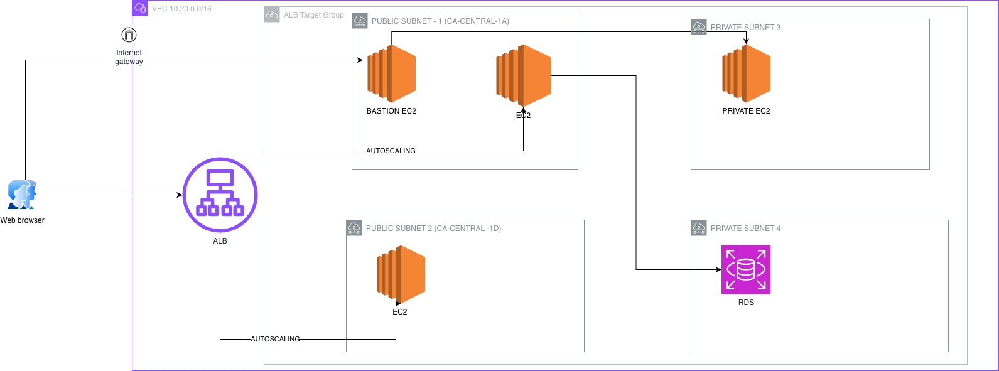

## Architecture Diagram

# Core_Services_AWS_Project

1. IAM & Access Control Automation
	•	Created IAM users using Terraform
	•	Assigned permissions required to manage:
	•	VPC
	•	EC2
	•	Security Groups
	•	Load Balancer resources
	•	Enabled repeatable, auditable access provisioning
	•	Avoided manual console changes to reduce configuration drift

Security Best Practice
	•	Infrastructure access is defined as code
	•	Prevents over-permissioned users
	•	Supports auditing and compliance

2. Secure Network Design (VPC)
	•	Created a custom VPC with private IP addressing
	•	Enabled DNS hostnames for internal service resolution
	•	Designed a multi-tier network layout:
	•	Public subnets for ALB, Bastion host, and public EC2
	•	Private subnets for backend EC2 instances
	•	Distributed subnets across multiple Availability Zones to ensure high availability

Security Best Practice
	•	Clear separation of public and private resources
	•	Private instances have no direct internet exposure
	•	Reduces attack surface

3. Controlled Internet Access
	•	Configured an Internet Gateway for public subnets
	•	Implemented a NAT Gateway to allow outbound internet access from private subnets
	•	Used separate route tables for public and private subnets

Security Best Practice
	•	Private instances can download updates without being publicly accessible
	•	Prevents inbound internet traffic to private workloads

4. Security Groups & Traffic Control

Implemented layered security groups with strict rules:

Application Load Balancer Security Group
	•	Allows inbound HTTP (80) from the internet
	•	Acts as the only public entry point to the application

Public EC2 Security Group
	•	Allows HTTP traffic only from the ALB security group
	•	Does not allow direct internet access
	•	SSH access restricted to a specific trusted IP

Bastion Host Security Group
	•	SSH access allowed only from a single trusted IP address
	•	Used for secure administrative access

Private EC2 Security Group
	•	SSH access allowed only from the Bastion host
	•	No inbound access from public subnets or the internet

Security Best Practices
	•	Principle of least privilege
	•	Security-group-to-security-group communication (not open CIDR ranges)
	•	No direct SSH to private instances
	•	Bastion pattern prevents lateral movement

5. Compute Layer (EC2)
	•	Provisioned EC2 instances using Terraform:
	•	Public EC2 instances registered behind ALB
	•	Private EC2 instance isolated from public access
	•	Dedicated Bastion host for administration
	•	Used key-based authentication (no passwords)

Security Best Practice
	•	Eliminates password-based SSH attacks
	•	Centralized administrative access via Bastion host

6. Application Load Balancer (ALB)
	•	Deployed an internet-facing ALB
	•	Configured across multiple Availability Zones
	•	Created a target group for backend EC2 instances
	•	Attached EC2 instances to the target group
	•	Implemented an HTTP listener with forward action
	•	Designed architecture to easily support HTTPS via ACM in the future

Security Best Practice
	•	ALB terminates client connections
	•	Backend instances are shielded from direct exposure
	•	Ready for TLS termination and certificate rotation

Security Highlights (Summary)

✔ Infrastructure as Code (no manual drift)
✔ Least-privilege IAM access
✔ Bastion host for controlled SSH access
✔ No direct public access to private EC2 instances
✔ Security-group-based traffic filtering
✔ Network segmentation using public/private subnets
✔ High availability across Availability Zones

Project Outcome
	•	Successfully deployed a production-grade AWS infrastructure
	•	Demonstrated strong understanding of AWS networking, security, and IaC
	•	Built a scalable and secure foundation ready for:
	•	HTTPS with ACM
	•	Auto Scaling Groups
	•	CI/CD pipelines
	•	Monitoring and observability

Future Enhancements
	•	Enable HTTPS using AWS Certificate Manager
	•	Add HTTP → HTTPS redirect
	•	Introduce Auto Scaling Groups
	•	Integrate CloudWatch monitoring and alerts
	•	Implement CI/CD pipeline for application deployments

Why This Project Matters

This project reflects real-world DevOps practices, focusing not just on resource creation, but on security, automation, and maintainability, aligning with modern cloud engineering standards.

